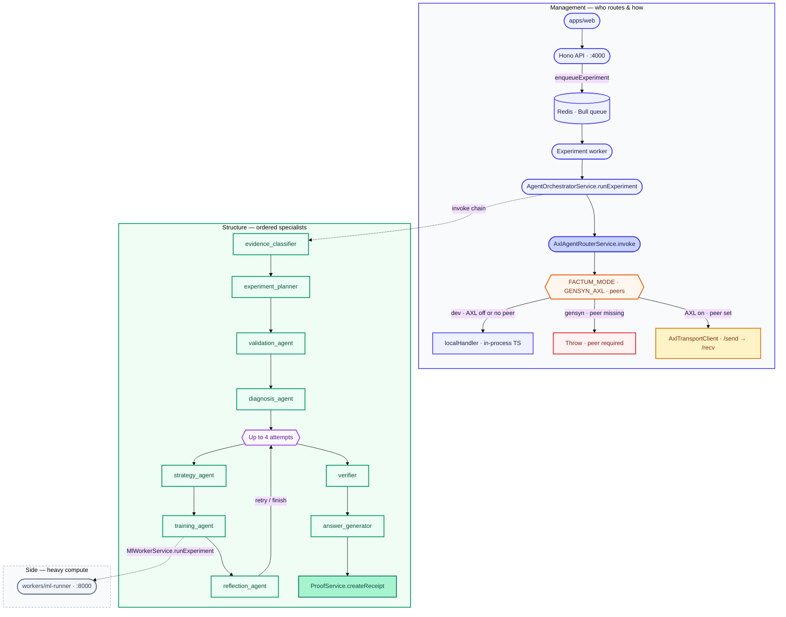
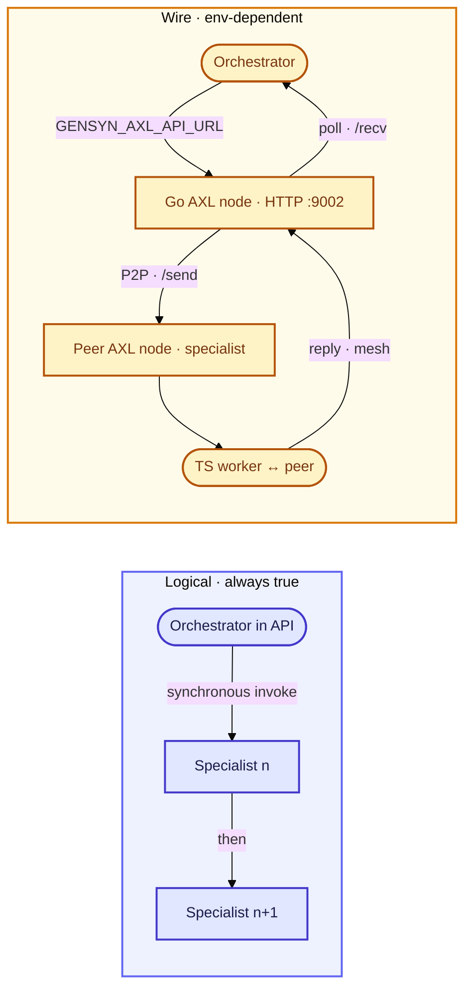
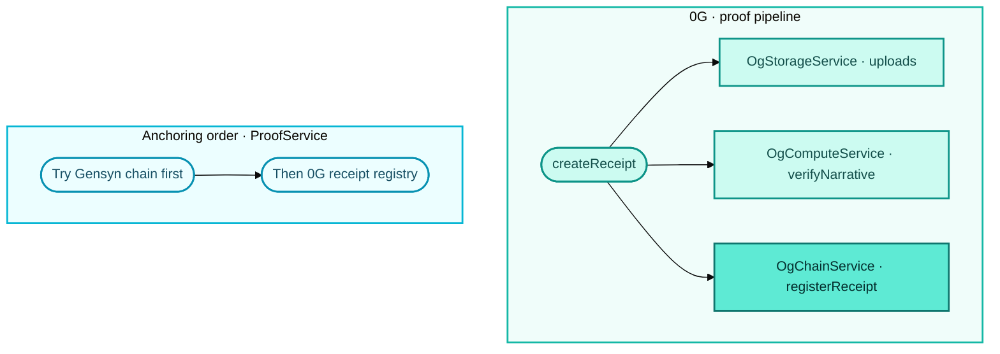
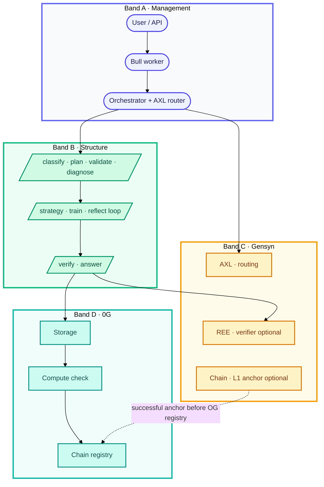

# Factum architecture flow

This document is a **readable map** of how the stack fits together: **who decides and routes** (management), **what runs in order** (structure), **where Gensyn shows up**, and **where 0G (“OG”) shows up**.

For local bring-up and env profiles, see [nodes-runbook.md](./nodes-runbook.md). For AXL HTTP semantics, see [axl/AGENTS.md](../axl/AGENTS.md).

**Diagram key (throughout this page):** indigo = **management / routing**, green = **specialist structure**, amber / gold = **Gensyn** surfaces, teal / cyan = **0G**, dashed strokes = **keys or optional paths**.

---

## 1. Management vs structure

| Layer | Role | Main code / config |
|--------|------|---------------------|
| **Management** | Job lifecycle, strictness, transport choice, progress to UI, DB | `AgentOrchestratorService`, Bull worker (`jobs/queue.ts`), `AxlAgentRouterService`, `FACTUM_MODE`, `GENSYN_AXL_*`, `AXL_PEER_*` |
| **Structure** | Ordered specialist steps, payloads, ML artifacts, receipt fields | `runExperiment()` sequence in `agent-orchestrator.service.ts`, `ProofService.createReceipt()` |

**Management** answers: *when* does an agent run, *local vs AXL*, and *what happens on timeout / missing peers*.  
**Structure** answers: *which* agent follows which, and *what data* flows (plan → validation → training → proof).

---

## 2. End-to-end flow (management + structure)

**Notes**

- Every boxed specialist goes through **`axlRouter.invoke`**: same *structure*, but **transport** is either **in-process** (`localHandler`) or **AXL** to a worker peer (topic `factum.<agent>`).
- **`training_agent`** is structural routing to the same invoke pattern; the **heavy compute** is typically the ML worker when running locally (`MlWorkerService.runExperiment`).

---

## 3. Agent-to-agent interaction (logical vs wire)

Specialists do **not** call each other directly. The **orchestrator** owns order, state, and DB updates; AXL only **relocates** where a given specialist’s code runs.

---

## 4. Where **Gensyn** is used

Gensyn appears in **three** separate places; they are **not** the same subsystem.

```mermaid
%%{init: {'theme': 'base', 'themeVariables': { 'fontSize': '15px' }}}%%
flowchart TB
  classDef axl fill:#fef3c7,stroke:#b45309,stroke-width:2px,color:#78350f
  classDef ree fill:#ffe4e6,stroke:#be123c,stroke-width:2px,color:#881337
  classDef chain fill:#e0e7ff,stroke:#3730a3,stroke-width:2px,color:#1e1b4b
  classDef key fill:#f1f5f9,stroke:#64748b,stroke-width:2px,stroke-dasharray: 4 2

  subgraph g_axl [" ① AXL — agent transport "]
    R([AxlAgentRouterService])
    T[AxlTransportClient]
    GK[AXL_PEER_* · 64-hex keys]
    R --> T
    GK -.->|resolve · to| R
    class R,T axl
    class GK key
  end

  subgraph g_ree [" ② REE — optional verifier run "]
    V([VerifierService.run])
    REE[GensynReeService · gensyn-sdk / ReeClient]
    OAI[OpenAI JSON · fallback]
    V -->|GENSYN_REE_ENABLED| REE
    V -->|else / REE failure| OAI
    class V,REE,OAI ree
  end

  subgraph g_chain [" ③ Gensyn chain — optional L1 anchor "]
    ANC([ProofService.anchorReceipt])
    GC[GensynChainService.anchorExperiment]
    OG0[Skip on disabled / error]
    ANC -->|client configured| GC
    ANC -->|disabled or error| OG0
    class ANC,GC,OG0 chain
  end

  style g_axl fill:#fffbeb,stroke:#d97706,stroke-width:2px
  style g_ree fill:#fff1f2,stroke:#e11d48,stroke-width:2px
  style g_chain fill:#eef2ff,stroke:#4f46e5,stroke-width:2px
```

| Gensyn piece | Purpose |
|--------------|---------|
| **AXL** | Route specialist work to **remote peers** over the Go node (`/send` / `/recv`), using **Ed25519 peer IDs** from env. |
| **REE** (`@factum/gensyn-ree`) | When enabled, run **verifier**-style checks via **`gensyn-sdk`** with receipts; optional **OpenAI** fallback inside `VerifierService`. |
| **Gensyn chain** | When `GENSYN_CHAIN_ENABLED` and keys/registry are valid, **anchor** experiment hashes on **Gensyn L1** before considering 0G. |

---

## 5. Where **0G (“OG”)** is used

0G is the **proof and persistence** stack: storage for artifacts, optional **compute** attestation on the narrative, and **on-chain** receipt registration.

| 0G piece | Role |
|----------|------|
| **Storage** (`OG_STORAGE_*`) | Upload dataset, reports, manifest, final `proof_receipt.json`; URIs go into the receipt. |
| **Compute** (`OG_COMPUTE_*`) | Third-party-style **LLM check** on the verification narrative; metadata embedded as `computeProof` on the receipt when the client loads. |
| **Chain** (`OG_CHAIN_*`) | **Register** the receipt hash and related hashes; used when Gensyn anchoring is off or fails. |

---

## 6. Single swimlane view (compact)

**Note:** In the **Gensyn** band, **AXL / REE / Chain** are **different hooks** (not a pipeline); `~~~` only stacks them for layout.

---

## Related files

- Orchestration sequence: `apps/api/src/services/agent-orchestrator.service.ts`
- AXL routing: `apps/api/src/services/axl-agent-router.service.ts`
- Verifier + REE: `apps/api/src/services/agents/verifier.service.ts`, `apps/api/src/services/gensyn-ree.service.ts`
- Proof + 0G + Gensyn chain: `apps/api/src/services/proof.service.ts`
