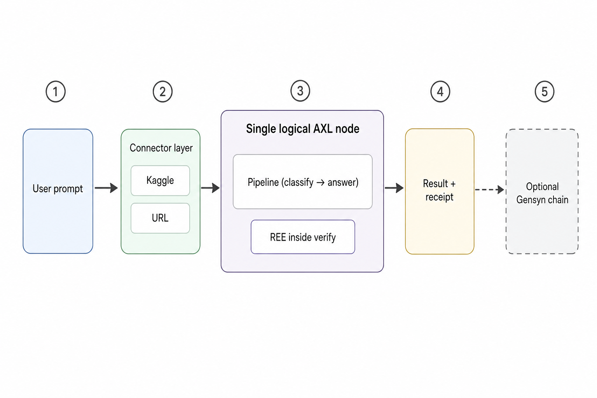
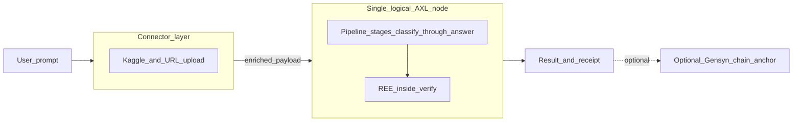

# Hackathon: single logical AXL node (concept vs code)

This page is the **product and operator narrative** for a simplified Gensyn / AXL story: one clear boundary after connectors, optional chain anchoring at the end, and an honest map to **how factuam implements** that story today.

For env profiles and commands, see [nodes-runbook.md](./nodes-runbook.md) (including the **Single-node AXL (hackathon)** section).

---

## Conceptual architecture (what we communicate)

- **Connectors stay upstream.** They **enrich** the payload (datasets, URLs, uploads). Adding a connector should not require editing core pipeline logic.
- **After connectors**, a **single logical “AXL node”** owns **job state, routing, and the specialist pipeline** end-to-end: classify → plan → validate → diagnose → strategy → train → reflect → verify → answer (ordering follows [`AgentOrchestratorService`](../apps/api/src/services/agent-orchestrator.service.ts)).
- **At the conceptual level**, when you are **not** distributing work across remote peers, there is **no separate “orchestrator vs worker” story** for audiences — one execution plane runs the pipeline.
- **Verify** is where **REE** can run so verification-oriented output exists **before** the answer and receipt are finalized (see [`VerifierService`](../apps/api/src/services/agents/verifier.service.ts)).
- **Gensyn chain** anchoring remains **optional** and **external**: a deliberate “make this public and permanent” step, not required to complete a run.

### Diagram (reference asset)

### Simplified flow (mermaid)

---

## Concept vs implementation (factuam today)

The diagram is **logical**. In the repo, processes are still split so we can use the **real Gensyn AXL** HTTP bridge (`/send`, `/recv`, `/topology`) for demos and hackathon checks.

| Concept (diagram) | Implementation (codebase) |
|-------------------|---------------------------|
| One process owns pipeline + job state | [`AgentOrchestratorService`](../apps/api/src/services/agent-orchestrator.service.ts) in the **API** owns **experiment state, DB, and step ordering**. |
| No transport hop “inside” the story | With **`GENSYN_AXL_ENABLED=true`** and **single-node mode**, agent work still goes **API → Go `axl/node` → unified TS worker**, and [**Redis**](../apps/api/src/services/axl-reply-broker.service.ts) returns replies so the API does not compete with the worker on the same `/recv` FIFO ([`AxlAgentRouterService`](../apps/api/src/services/axl-agent-router.service.ts), [`unified-axl.worker.ts`](../apps/api/src/axl-workers/unified-axl.worker.ts)). |
| REE inside verify | [`VerifierService`](../apps/api/src/services/agents/verifier.service.ts) runs REE when configured; orchestration calls verifier before answer / proof receipt flow. |
| Optional chain | [`ProofService`](../apps/api/src/services/proof.service.ts) + Gensyn chain / 0G paths as documented in [architecture-flow.md](./architecture-flow.md). |

**Closest match to “no AXL transport” for development:** `factuam_MODE=dev` and **`GENSYN_AXL_ENABLED=false`** — specialists run **in-process** via `localHandler` with no `/send` hop.

---

## Code pointers

| Piece | Role |
|-------|------|
| [`apps/api/src/services/axl-agent-router.service.ts`](../apps/api/src/services/axl-agent-router.service.ts) | Chooses AXL vs in-process; builds `factuam.<agent>` topics. |
| [`apps/api/src/services/axl-reply-broker.service.ts`](../apps/api/src/services/axl-reply-broker.service.ts) | Single-node mode: correlates replies over Redis. |
| [`apps/api/src/axl-workers/unified-axl.worker.ts`](../apps/api/src/axl-workers/unified-axl.worker.ts) | Single recv loop for all agent topics on one HTTP bridge. |
| [`apps/api/src/axl-workers/axl-agent-handlers.ts`](../apps/api/src/axl-workers/axl-agent-handlers.ts) | Dispatches topic → existing services. |
| [`packages/agent-sdk/src/peer-registry.ts`](../packages/agent-sdk/src/peer-registry.ts) | Optional **`AXL_SINGLE_PEER_ID`** fills all peer slots in gensyn mode. |

---

## Future (out of scope here)

A **true single OS process** that embeds the entire orchestrator and ML stack inside the Go `node` binary would be a **major product change**. Today’s split keeps **factuam’s experiment API**, **Postgres**, and **AXL interoperability** while still telling a simple hackathon story on stage.
