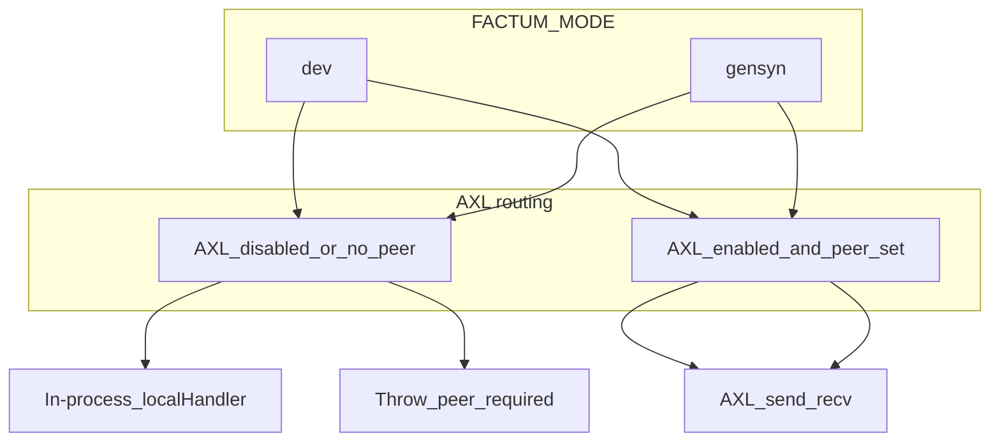

# Nodes runbook: local AXL, modes, and production

Use this as the **repeatable checklist** when you bring the stack up. For generic install steps, see [LOCAL_DEVELOPMENT.md](./LOCAL_DEVELOPMENT.md) and the root [README.md](../README.md). For AXL transport semantics (peer id = public key, `/send`, `/recv`, `/topology`), see [axl/AGENTS.md](../axl/AGENTS.md).

---

## Pick a profile (one per session)

| Profile | When to use | Typical env |
|--------|-------------|-------------|
| **Local — fastest** | UI and experiments without a Go AXL mesh or peer keys | `FACTUM_MODE=dev`, `GENSYN_AXL_ENABLED=false`, `GENSYN_AXL_LOCAL_FALLBACK=true` |
| **Local — full Gensyn mesh** | Same routing shape as demo/hackathon, all processes on your machine | `FACTUM_MODE=gensyn`, `GENSYN_AXL_ENABLED=true`, peers from automation (below) |
| **Production / shared demo** | Real hosts, bootstrap peers, no accidental fallback | `FACTUM_MODE=gensyn`, `GENSYN_AXL_ENABLED=true`, real `Peers` in node config, `AXL_PEER_*` from each node’s `/topology`, `GENSYN_AXL_LOCAL_FALLBACK=false` when you want strict AXL |

**Default `FACTUM_MODE`:** If you omit it, the API defaults to **`gensyn`** (`apps/api/src/config.ts`). For **Local — fastest**, set `FACTUM_MODE=dev` explicitly so missing peers do not fail the process.

**Env file loading (API):** root `.env` → `apps/api/.env` (overrides) → **`.env.local.axl`** at repo root (overrides when present). The local mesh script writes `.env.local.axl`; restart the API after it changes. See `dotenv` order in `apps/api/src/config.ts`.

---

## Each time you run — local checklist

1. **Infra**
   - [ ] `docker compose up -d postgres redis`
   - [ ] `yarn db:migrate` (after schema changes or first clone)

2. **Choose profile**
   - **Fastest:** set env per the table above; skip AXL steps.
   - **Full local mesh:**
     - [ ] Go toolchain for AXL: from `axl/`, `GOTOOLCHAIN=go1.25.5 make build` if `axl/node` is missing (see `axl/docs/configuration.md`). The stack driver also runs `make build` on first launch if needed (needs Go **1.25.x** / toolchain fetch on first run).
     - [ ] Ed25519 keys: `yarn local:axl` and `yarn local:axl:nodes` **run key generation first** (`scripts/ensure-axl-local-keys.mjs`, requires **OpenSSL**). Optional: run `yarn local:axl:keys` alone to create `agents/local/<role>/private.pem` without starting nodes.
     - [ ] Either `yarn local:axl` (Go nodes + writes `.env.local.axl` + TS workers), **or** split: `yarn local:axl:nodes` in one terminal, then `yarn dev:axl` in another.
     - [ ] **Restart `yarn api` / `yarn dev`** after `.env.local.axl` is created or regenerated so peer keys load.

3. **ML worker** (training path)
   - [ ] `yarn worker` when you run experiments that hit the training agent.

4. **App**
   - [ ] `yarn dev` (web + api + ml-runner in turbo), or split: `yarn web`, `yarn api`, `yarn worker` as you prefer.

5. **Optional checks**
   - [ ] `curl http://localhost:4000/health`
   - [ ] `yarn check:axl` (worker health via API)

**Automation reference**

- Topology and ports: `scripts/axl-local-topology.mjs` — orchestrator HTTP **9002**; specialists **9012**–**9092** (includes **validation 9032**). Override Go binary path with **`AXL_NODE_BIN`** if needed.
- Stack driver: `scripts/local-axl-stack.mjs` (`yarn local:axl`, `yarn local:axl:nodes`)
- Per-worker AXL HTTP bridge: `scripts/dev-axl.mjs` (`yarn dev:axl`) — each worker uses the correct `GENSYN_AXL_API_URL` for its local node port.
- Committed configs: `agents/local/<role>/node-config.json`
- **`.env.local.axl` keys** (when generated locally): `GENSYN_AXL_API_URL`, `AXL_PEER_CLASSIFIER`, `AXL_PEER_PLANNER`, `AXL_PEER_VALIDATION`, `AXL_PEER_DIAGNOSIS`, `AXL_PEER_STRATEGY`, `AXL_PEER_TRAINING`, `AXL_PEER_REFLECTION`, `AXL_PEER_VERIFIER`, `AXL_PEER_ANSWER`.

**If `yarn local:axl` / `yarn local:axl:nodes` fails**

- **HTTP bind errors (`address already in use` on `9002`, etc.):** Something else is using an AXL HTTP port. Stop leftover `axl/node` processes or other services; the stack script checks ports up front and starts the **orchestrator first**, then specialists (see `scripts/local-axl-stack.mjs`).
- **Node 25+ and topology polling:** The driver uses `node:http` for `/topology` (not `fetch`) to avoid a known `setTypeOfService EINVAL` issue with undici on some systems.

---

## Production checklist (high level)

- [ ] **Secrets:** no `private.pem` or operator keys in git; use secret store or mounted files on hosts.
- [ ] **Identity:** stable `PrivateKeyPath` per role so `our_public_key` in `/topology` does not change unexpectedly.
- [ ] **Mesh:** `Peers` and optional `Listen` in each `node-config.json` match your deployment (bootstrap URIs, firewall rules).
- [ ] **Factum env:** set `GENSYN_AXL_API_URL` to the bridge used by the API (orchestrator side). Set each specialist **`AXL_PEER_*`** to the **64-hex** `our_public_key` from that role’s `/topology`. Alternatively, **`GENSYN_AXL_AGENT_PEERS`** can hold a JSON map of orchestrator agent names → hex keys; **per-agent `AXL_PEER_*` env vars win** when both are set (`apps/api/src/services/axl-agent-router.service.ts`). Malformed JSON logs a warning and behaves like an empty map.
- [ ] **Strictness:** `FACTUM_MODE=gensyn`; turn off `GENSYN_AXL_LOCAL_FALLBACK` when you must not silently run in-process agents.
- [ ] **Timeouts:** defaults are **`GENSYN_AXL_TIMEOUT_MS=1500`** and **`GENSYN_AXL_POLL_INTERVAL_MS=250`** (`apps/api/src/config.ts`). The 1.5s window is tight on slow hosts or WAN; increase timeout (and interval if needed) for production or flaky local meshes.
- [ ] **REE / chain:** configure per environment (see README “Important env groups”).

---

## FAQ: `FACTUM_MODE=dev` vs Gensyn / AXL

**Q: If `FACTUM_MODE` is `dev`, are we running no Gensyn nodes?**

**A: Not automatically.** `FACTUM_MODE` controls **strictness and fallbacks**, not a single “off switch” for the whole Gensyn stack.

1. **Startup / peer env** (`packages/agent-sdk/src/peer-registry.ts`): Importing `@factum/agent-sdk` evaluates `PEERS` and, in **`gensyn`**, **throws at import time** if any **listed** `AXL_PEER_*` is missing (today: classifier, planner, diagnosis, strategy, training, reflection, verifier, answer). In **`dev`**, those may be empty without crashing. **`AXL_PEER_VALIDATION`** is **not** in that `PEERS` object but is still set by local automation and **must** be present for routed `validation_agent` when you run the full mesh with AXL (same as other specialists); the orchestrator reads it via `config` / `.env.local.axl`.

2. **Where an agent runs** (`apps/api/src/services/axl-agent-router.service.ts`, `invoke`):
   - **In-process** (`localHandler` only): `FACTUM_MODE=dev` **and** (`GENSYN_AXL_ENABLED=false` **or** no resolved peer id for that agent). This is the usual “fast local” setup.
   - **Over AXL:** `GENSYN_AXL_ENABLED=true` **and** a peer id is set — **even in `dev`**, the router will use `AxlTransportClient` (`/send` / `/recv`) like the gensyn-first path.
   - **`gensyn`** with AXL off or missing peer: **throws** (`AXL peer is required for …`).
   - After an AXL timeout, `GENSYN_AXL_LOCAL_FALLBACK=true` may fall back to in-process code; the `catch` path still **rethrows when `FACTUM_MODE=gensyn`**, so error-driven fallback is mainly relevant in **`dev`**.

**Q: Is Gensyn still the “main” architecture?**

**A:** For demos, hackathons, and production alignment, treat **`FACTUM_MODE=gensyn`** + **AXL enabled** + **real peers** as the canonical story. **`dev`** is primarily **developer ergonomics** (boot without peers, in-process agents when AXL is off or unset). REE and chain are separate flags; see README “Recommended modes” and “Important env groups”.

---

## Related docs

- [README.md](../README.md) — full stack, env groups, troubleshooting
- [LOCAL_DEVELOPMENT.md](./LOCAL_DEVELOPMENT.md) — short local path
- [ENVIRONMENT_VARIABLES.md](./ENVIRONMENT_VARIABLES.md) — env reference
- [axl/AGENTS.md](../axl/AGENTS.md) — node HTTP API and peer identity
